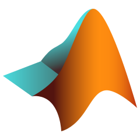

<!--
 

-->

   
  

## I'm a graduating college student! 😁

- 📗 I'm currently studying at ***[De La Salle University - Manila, Philippines]***.
- 💻 I'm taking up ***Bachelor of Science in Computer Science, Major in Computer Systems Engineering***.
- 😮 Fun fact about me: I love learning new things 📖

### Feel free to contact me:

- [][hernandez.pierrevincent@gmail.com] E-Mail : [hernandez.pierrevincent@gmail.com]
- [][Pierre Vincent Hernandez] LinkedIn : [Pierre Vincent Hernandez]

## Skills 🛠️

### Programming Languages:

[][c]
[][cpp]
[][rust]
[][x86_asm]
[][riscv_asm]
[][java]
[][ruby]
[][python]
[][matlab]
[][html]
[][css]
[][javascript]
[][typescript]

### Database:

[][mysql]
<!-- postresql -->
<!-- graphql -->
[][mongodb]

### Frameworks and Libraries

<!-- c/c++ cuda -->
<!-- NumPy,  -->
<!-- Pandas,  -->
<!-- OpenCV,  -->
<!-- TensorFlow,  -->
[][nodejs]
[][expressjs]
<!-- NestJS, -->
<!-- Vue.js /  -->
<!-- Nuxt -->
<!-- React -->
<!-- Next.js,  -->
<!-- Svelte /  -->
<!-- SvelteKit,  -->
<!-- Bootstrap,  -->
<!-- Tailwind CSS -->

# Tools:

<!-- LTSpice,  -->
<!-- KiCAD,  -->
<!-- Windows Subsystem for Linux (WSL),  -->
<!-- GNU Bash,  -->
<!-- Docker,  -->
<!-- Jupyter Notebook -->
<!-- Conda/Miniconda -->
<!-- Visual Studio -->
[][git]
<!-- Github -->
<!-- Bitbucket -->

<!----- LINKS ----->

<!-- Brief Info/Intro -->
[De La Salle University - Manila, Philippines]: https://www.dlsu.edu.ph/

<!-- Contacts -->
[hernandez.pierrevincent@gmail.com]: mailto:hernandez.pierrevincent@gmail.com
[Pierre Vincent Hernandez]: https://www.linkedin.com/in/pierre-vincent-hernandez/

<!-- Programming Languages -->
[c]: https://www.cprogramming.com/
[cpp]: https://isocpp.org/
[rust]: https://www.rust-lang.org/
[x86_asm]: https://en.wikipedia.org/wiki/X86_assembly_language
[riscv_asm]: https://riscv-programming.org/
[java]: https://www.java.com/
[ruby]: https://www.ruby-lang.org/en/
[python]: https://www.python.org/
[matlab]: https://www.mathworks.com/products/matlab.html
[html]: https://html.com/
[css]: https://www.w3schools.com/Css/
[javascript]: https://www.javascript.com/
[typescript]: https://www.typescriptlang.org/

<!-- Database -->
[mysql]: https://www.mysql.com/
<!-- postresql -->
<!-- graphql -->
[mongodb]: https://www.mongodb.com/

<!-- Frameworks and Libraries -->
<!-- c/c++ cuda -->
<!-- NumPy,  -->
<!-- Pandas,  -->
<!-- OpenCV,  -->
<!-- TensorFlow,  -->
[nodejs]: https://nodejs.org/
[expressjs]: http://expressjs.com/
<!-- NestJS, -->
<!-- Vue.js /  -->
<!-- Nuxt -->
<!-- React -->
<!-- Next.js,  -->
<!-- Svelte /  -->
<!-- SvelteKit,  -->
<!-- Bootstrap,  -->
<!-- Tailwind CSS -->

<!-- Tools -->
<!-- LTSpice,  -->
<!-- KiCAD,  -->
<!-- Windows Subsystem for Linux (WSL),  -->
<!-- GNU Bash,  -->
<!-- Docker,  -->
<!-- Jupyter Notebook -->
<!-- Conda/Miniconda -->
<!-- Visual Studio -->
[git]: https://git-scm.com/
<!-- Github -->
<!-- Bitbucket -->
